# 4-bit Carry Look-Ahead Adder — 180 nm CMOS

A full-custom 4-bit Carry Look-Ahead (CLA) adder I designed end-to-end in **180 nm CMOS**, from logic and transistor sizing all the way to layout, parasitic-extracted simulation, and an FPGA demo. The combinational adder is built in **static CMOS** and the input/output registers use a **TSPC (True Single-Phase Clock) D flip-flop**.

This was my VLSI Design course project at IIIT Hyderabad. I'm putting it up as a single, organised repository so the whole flow — schematic → layout → post-layout → RTL → hardware — can be followed in one place.

## Headline results

| Metric | Value |
|---|---|
| Technology | 180 nm (TSMC model), VDD = 1.8 V |
| Max reliable clock | **1.25 GHz** (800 ps period) |
| Average power | **5.393 mW** |
| Power–delay product (CLA core) | **3.97 × 10⁻¹² Ws** |
| Critical path | `a0 → s3` |
| Final layout area | 64.08 µm × 86.31 µm |

## What is a CLA adder?

A ripple-carry adder is slow because each bit waits for the carry from the bit below it. A CLA adder breaks that dependency: it computes, for every bit, a **generate** term `Gᵢ = Aᵢ·Bᵢ` (this bit makes a carry on its own) and a **propagate** term `Pᵢ = Aᵢ ⊕ Bᵢ` (this bit passes an incoming carry along). With these, every carry can be written directly in terms of the inputs:

```
C1 = G0
C2 = G1 + P1·G0
C3 = G2 + P2·G1 + P2·P1·G0
C4 = G3 + P3·G2 + P3·P2·G1 + P3·P2·P1·G0     (carry out)

s0 = A0 ⊕ B0
sᵢ = Aᵢ ⊕ Bᵢ ⊕ Cᵢ
```

So all carries are produced in parallel instead of rippling, which is where the speed comes from.

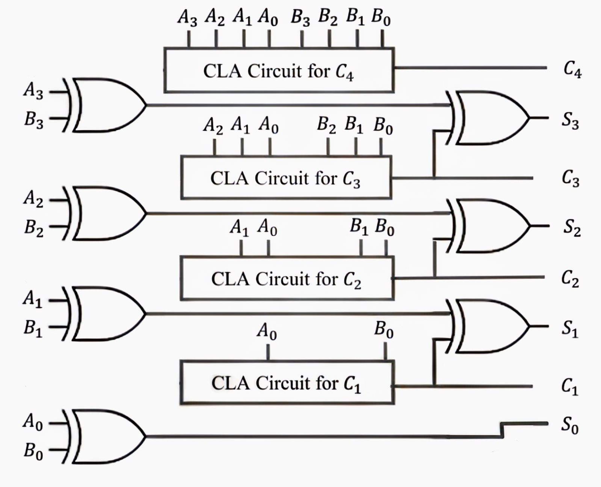

The inputs and outputs are registered by TSPC D flip-flops so the whole block behaves as one synchronous stage: inputs are latched on a clock edge, and the result is available at the next edge.

---

## Design flow (what I did, step by step)

### 1–2. Logic design, topology and sizing

I implemented each `Gᵢ` as an AND gate and each `Pᵢ` as an XOR gate, then built the carry equations above as static CMOS complex gates. Each sum bit drives an output inverter (Wp/Wn = 20λ/10λ).

| | |
|---|---|
| 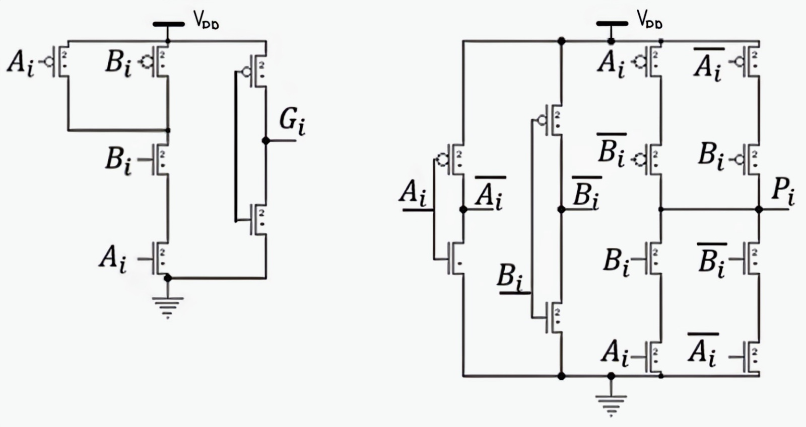 | 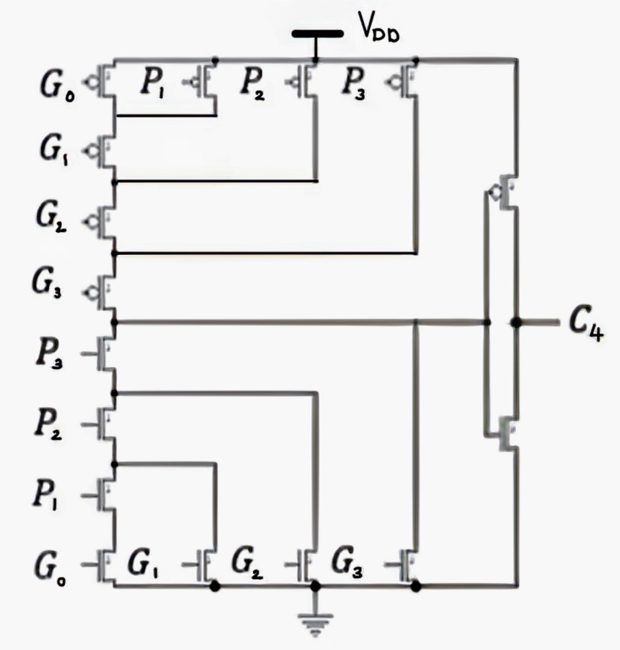 |
| Generate (AND) and Propagate (XOR) gates | Static CMOS complex gate for the C4 carry |

For sizing I went with a symmetric **2W/W** ratio for almost every module — this kept the layout regular and let me build clean Euler-path stick diagrams later. I only deviated for the AND gate (2W/2W gave the best delay). The XOR was marginally faster at 4W/W, but the improvement was small and not worth breaking layout symmetry, so it stayed at 2W/W.

The registers use a TSPC D flip-flop. I chose TSPC because it needs only a single clock (no complementary clock distribution), which keeps the clock network simple and the load light.

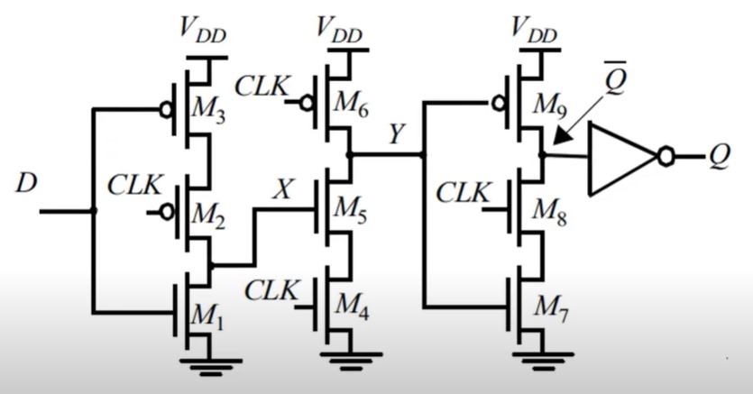

### 3. Block-level functional simulation (NGSPICE)

I wrote a SPICE netlist for each module and verified its truth table under a realistic load. Delay and RMS power were measured for every block.

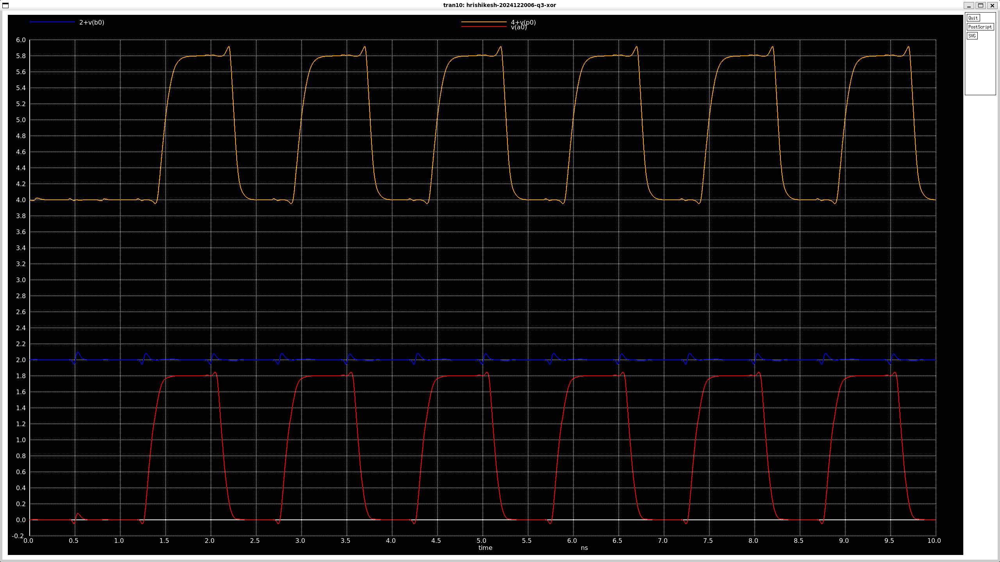

| Module | Delay (s) | RMS Power (W) |
|---|---|---|
| Inverter | 5.31 × 10⁻¹¹ | 2.08 × 10⁻⁴ |
| XOR | 1.39 × 10⁻¹⁰ | 3.34 × 10⁻⁴ |
| AND | 1.60 × 10⁻¹⁰ | 4.98 × 10⁻⁴ |
| C2 logic | 2.87 × 10⁻¹⁰ | 2.44 × 10⁻⁴ |
| C3 logic | 3.90 × 10⁻¹⁰ | 1.91 × 10⁻⁴ |
| C4 logic | 4.97 × 10⁻¹⁰ | 1.48 × 10⁻⁴ |

→ Netlists: [`spice/blocks/`](spice/blocks/), [`spice/delay_power/`](spice/delay_power/)

### 4. Flip-flop timing (setup, hold, clock-to-Q)

I characterised the TSPC flip-flop by sweeping the data edge against the clock edge and finding the point just before the output corrupts. This gave me setup time, hold time and the clock-to-Q delay (`tpcq`) for both transitions.

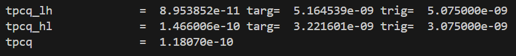

| Transition | t_setup | t_hold | t_pcq |
|---|---|---|---|
| Low → High | 24 ps | 40 ps | 8.95 × 10⁻¹¹ s |
| High → Low | 50 ps | 30 ps | 1.47 × 10⁻¹⁰ s |

→ Netlist: [`spice/dff_timing/dff_fused.cir`](spice/dff_timing/dff_fused.cir)

### 5. Stick diagrams

Before drawing the layout I made Euler-path-based stick diagrams for every unique gate so that the diffusion strips were continuous and the cells stayed compact and regular.

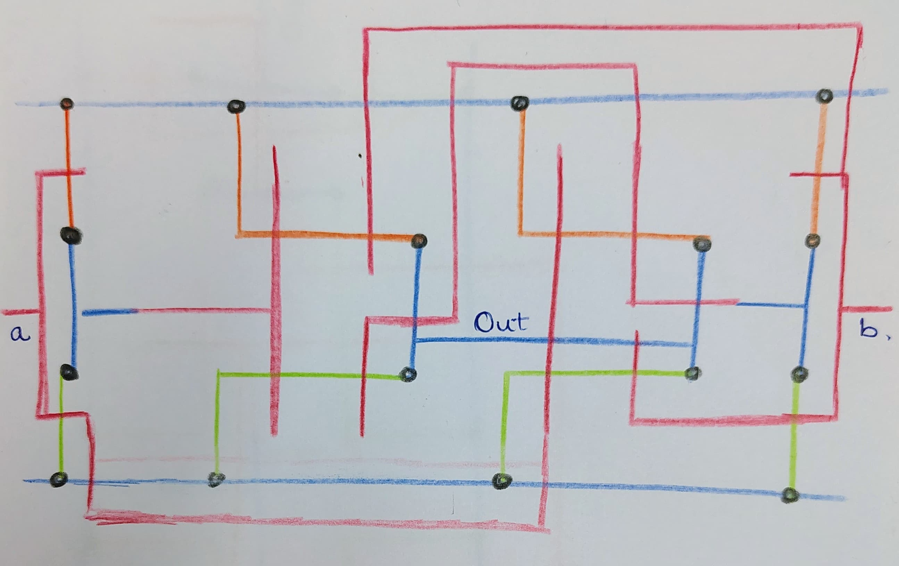

*(All stick diagrams — AND, XOR, C2, C3/C4, DFF, inverter — are in the [report](docs/report.pdf).)*

### 6. Block-level layout + post-layout verification (MAGIC)

I laid out each block in MAGIC using the `SCN6M_DEEP.09` tech file, then extracted parasitics and re-simulated. One thing I learned here: when a whole gate is squeezed into a single diffusion area, only one transistor touches VDD/GND, which hurts the rise/fall time. So I deliberately split larger gates into smaller diffusion regions with more supply contacts to lower resistance.

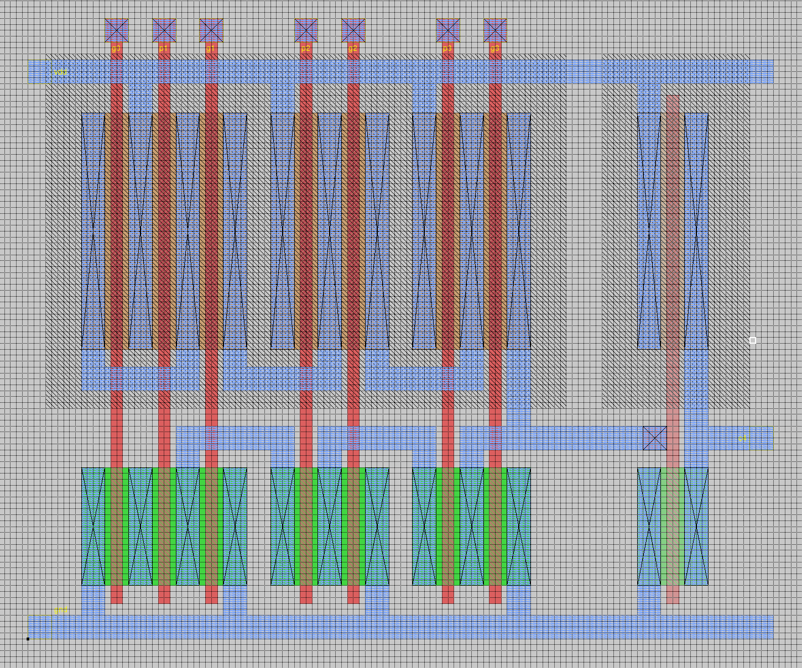

The post-layout delays tracked the schematic closely for most blocks — the comparison tables are in the [report](docs/report.pdf).

→ Layouts: [`layout/blocks/`](layout/blocks/) · Extracted sims: [`post_layout_sim/block_wise/`](post_layout_sim/block_wise/)

### 7. Full-circuit integration

I stitched all the blocks together — input flip-flops → P/G → carry logic → sum → output flip-flops — into one netlist and verified the complete synchronous adder in NGSPICE.

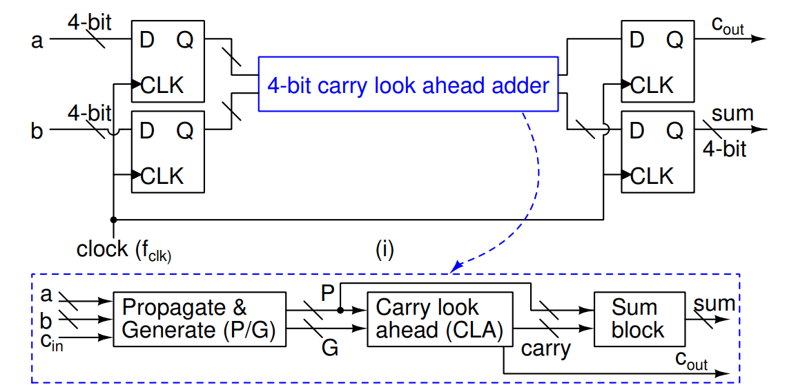

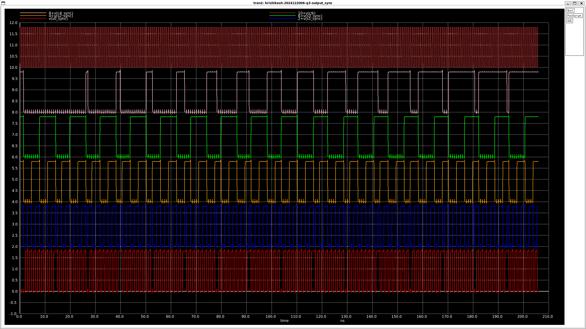

In the waveforms, `a0_unsync…` are the raw test inputs, `a0…` are the registered CLA inputs, `c4,s3…s0` are the CLA outputs, and `…_sync` are the final registered outputs.

→ Netlists: [`spice/integrated/`](spice/integrated/)

### 8. Floor plan

I planned the placement of all 16 flip-flops and the combinational blocks so the regular structures lined up, and identified the horizontal/vertical pitches.

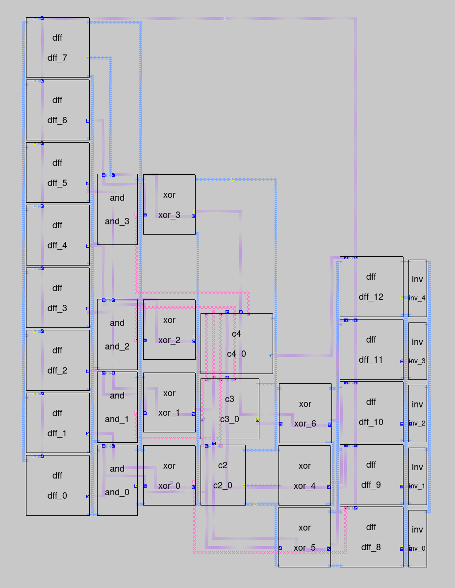

### 9–10. Full-chip layout, extraction and timing

I assembled the complete layout, extracted the parasitic netlist, and repeated every simulation on it. The worst case path is `a0 → s3`. From the extracted netlist:

```
t_CLK ≥ t_p + t_setup + t_pcq = 532 + 30 + 174 = 736 ps
```

I saw glitches right at 736 ps, so I picked **800 ps (1.25 GHz)** as the reliable operating period.

| | |
|---|---|
| 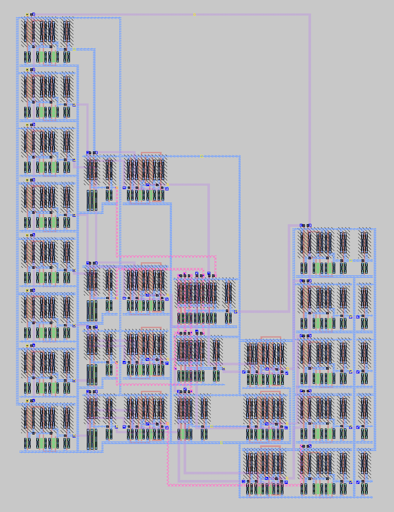 | 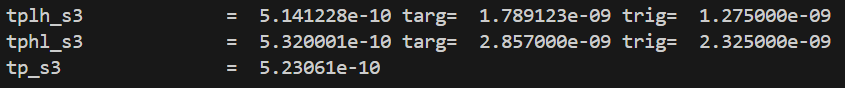 |
| Complete extracted layout | Critical path (`a0 → s3`) delay |

→ Layout: [`layout/full_chip/`](layout/full_chip/) · Extracted sims: [`post_layout_sim/full_chip/`](post_layout_sim/full_chip/)

### 11. Verilog (structural) + simulation

I also described the same circuit structurally in Verilog — gate primitives for the CLA, a parameterised D flip-flop for the registers, and an on-chip clock divider (built from T flip-flops) that walks through all 256 input combinations so the adder can be exercised exhaustively. Verified in GTKWave.

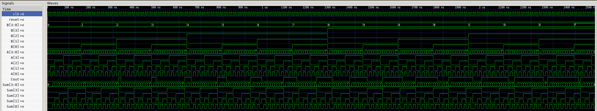

→ RTL: [`verilog/rtl/`](verilog/rtl/) · Testbench: [`verilog/tb/`](verilog/tb/)

### 12. FPGA implementation

Finally I put the design on a Boolean Board FPGA. The internal clock divider drives the inputs, and I captured the outputs (C4, S3, S2, S1, S0) on a logic analyzer to confirm the hardware matches simulation.

| | |
|---|---|
| 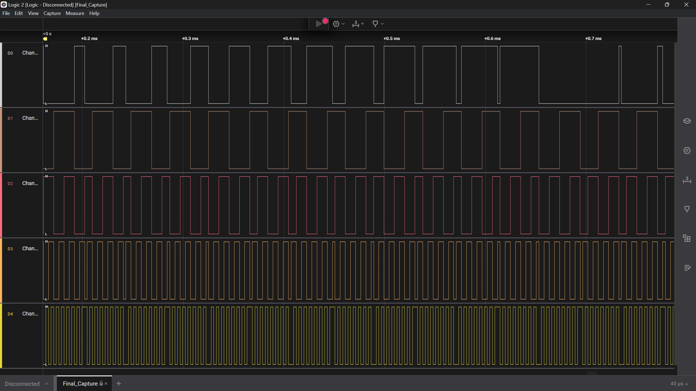 | 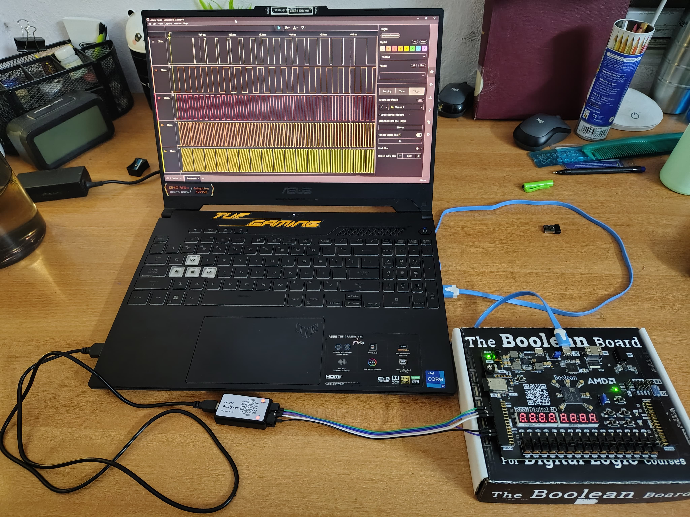 |
| Logic-analyzer capture of outputs | Hardware test setup |

→ Capture file: [`fpga/capture/Final_Capture.sal`](fpga/capture/) (open with Saleae Logic 2)

---

## Repository layout

```
4bit-cla-adder-180nm/
├── docs/
│   ├── report.pdf                 # full project report
│   ├── problem_statement.pdf      # original assignment
│   ├── references/                # cited papers
│   ├── report_source/             # LaTeX source + all figures
│   └── images/                    # figures used in this README
├── spice/
│   ├── models/                    # TSMC 180 nm model card
│   ├── blocks/                    # per-block functional netlists  (Task 3)
│   ├── dff_timing/                # setup/hold/clk-to-Q            (Task 4)
│   ├── integrated/                # full adder netlist             (Task 7)
│   └── delay_power/               # per-output delay + power       (Tasks 3,10)
├── layout/
│   ├── tech/                      # SCN6M_DEEP.09 tech file
│   ├── devices/                   # sized NMOS/PMOS device cells
│   ├── blocks/                    # per-block MAGIC layouts (.mag) + extracted (.spice)
│   └── full_chip/                 # complete layout + extracted netlist
├── post_layout_sim/
│   ├── block_wise/                # extracted block simulations    (Task 6)
│   └── full_chip/                 # extracted full-chip simulation (Task 9)
├── verilog/
│   ├── rtl/                       # structural Verilog
│   ├── tb/                        # testbench
│   └── sim/                       # VCD + GTKWave session
└── fpga/
    └── capture/                   # logic-analyzer capture
```

## Tools

- **NGSPICE** — circuit simulation (180 nm TSMC model)
- **MAGIC** — full-custom layout and parasitic extraction (`SCN6M_DEEP.09` tech)
- **Icarus Verilog + GTKWave** — RTL simulation
- **Saleae Logic 2** — FPGA output capture

To re-run a SPICE deck, MAGIC layout, or the RTL, see the notes at the top of each netlist / source file. SPICE decks expect the model card `TSMC_180nm.txt` to be on the include path.

## References

1. Md. Ashik Zafar Dipto, Elias Ahammad Sojib, Afran Sorwar, Md. Mostak Tahmid Rangon, *"Performance Improvement in Conventional 4-bit Static CMOS Carry Look-Ahead Adder by Modifying Carry-Generate and Propagate Terms,"* 11th ICCCNT, IIT Kharagpur, July 2020. → [`docs/references/CLA_static_CMOS_ICCCNT_2020.pdf`](docs/references/CLA_static_CMOS_ICCCNT_2020.pdf)
2. Behzad Razavi, *"A Circuit for All Seasons — The TSPC Logic,"* IEEE Solid-State Circuits Magazine, Fall 2016. → [`docs/references/Razavi_TSPC_Logic_IEEE_SSCM_2016.pdf`](docs/references/Razavi_TSPC_Logic_IEEE_SSCM_2016.pdf)
3. N. Weste and D. Harris, *CMOS VLSI Design*, 4th ed., Addison-Wesley.

---

*Hrishikesh Gawas — VLSI Design course project, IIIT Hyderabad.*
